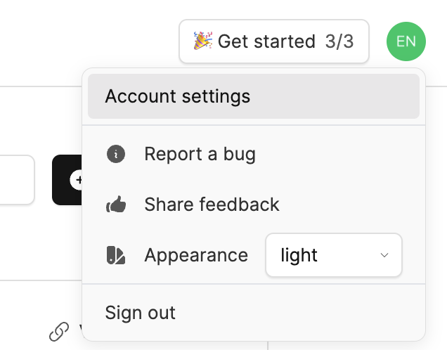
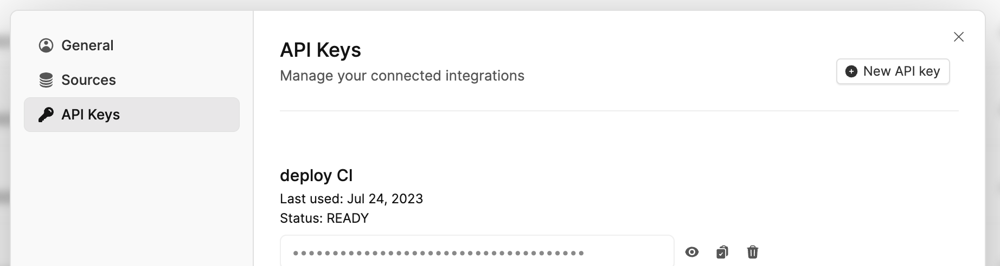

# Kubernetes Source

## Installation

Create an API Key in Overmind under Account settings > API Keys




Install the source into your Kubernetes cluster using Helm:

```shell
helm repo add overmind https://overmindtech.github.io/k8s-source
helm install overmind-kube-source overmind/overmind-kube-source --set source.apiKey=ovm_api_YOURKEY_HERE
```

To upgrade:

```shell
helm upgrade overmind-kube-source overmind/overmind-kube-source
```

To uninstall:

```shell
helm uninstall overmind-kube-source
```

## Support

This source will support all Kubernetes versions that are currently maintained in the kubernetes project. The list can be found here: https://kubernetes.io/releases/

## Search

The backends in this package implement the `Search()` method. The query format that they are expecting is a JSON object with one or more of the following keys, with strings in the corresponding string format:

* `labelSelector`: https://kubernetes.io/docs/concepts/overview/working-with-objects/labels/
* `fieldSelector`: https://kubernetes.io/docs/concepts/overview/working-with-objects/field-selectors/

An example would be:

```json
{
    "labelSelector": "app=wordpress"
}
```

or

```json
{
    "labelSelector": "environment=production,tier!=frontend",
    "fieldSelector": "metadata.namespace!=default"
}
```

Other fields can also be set of advanced querying is required, these fields must match the JSON schema for `ListOptions`: https://pkg.go.dev/k8s.io/apimachinery@v0.19.2/pkg/apis/meta/v1#ListOptions

## Development

### Testing

The tests for this package rely on having a Kubernetes cluster to interact with. This is handled using [kind](https://github.com/kubernetes-sigs/kind) when the tests are started. Please make sure that you have the required software installed:

* [kind](https://github.com/kubernetes-sigs/kind)
* [kubectl](https://kubernetes.io/docs/tasks/tools/)
* [Docker](https://docs.docker.com/get-docker/)

**IMPORTANT:** If you already have kubectl configured and are connected to a cluster, that cluster is what will be used for testing. Resources will be cleaned up with the exception of the testing namespace. If a cluster is not configured, or not available, one will be created (and destroyed) using `kind`. This behavior may change in the future as I see it being a bit risky as it could accidentally run the tests against a production cluster, though that would be a good way to validate real-world use-cases.
